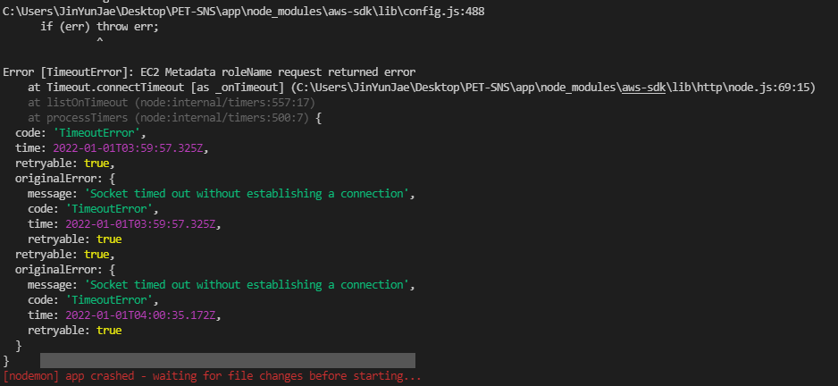

# pet-sns
## init / pakage
- multer / multer-s3
- mongoose
- socket.io
- jsonwebtoken
- bcrypt
- aws-sdk
## view & controller

## aws s3 % iam
- 온라인 스토리지 웹 서비스
- iam(Identify and Access Management) 권한 부여 서비스

### error 

- 해결방법 : S3에 연결하지 못했을때 생기는 문제 / config오류

## CRUD
## JWT(json web token) - sign in/sign up
### 구조
- header (토큰의 유형, 암호화 알고리즘).payload(토큰에 담을 정보- user정보 등).signature(secret key를 포함 - 복호화 암호화 기능의 키) 예) hhhh,pppp,ssss
### 기능
- 로그인/회원가입